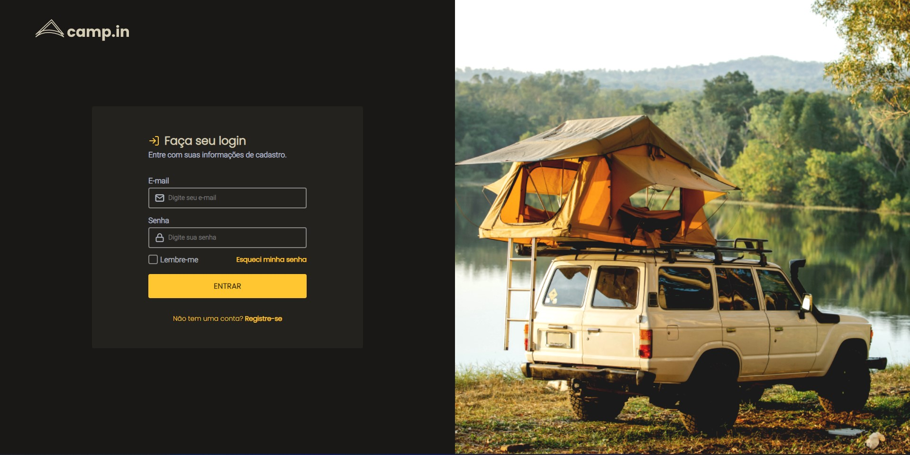

<h1 align="center">
  💻 Login Form CSS Rocketseat
</h1>

---

<h4 align="center"><a href="https://discover-challenge.vercel.app">Clique para visitar o projeto</a></h4>

---

## 💼 Tecnologias utilizadas

Utilizei apenas essas tecnologias com base em práticar meus conhecimentos:

-  HTML;
-  CSS;

---

> #### Inspirado no Desafio Login Form CSS da série Discover na Rocketseat!
>
> - <a href="https://app.rocketseat.com.br/discover/challenges">Clique aqui</a> para acessar ao desafio na Rocketseat.
>
---
